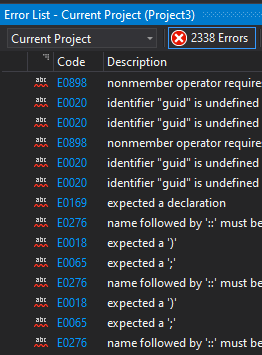

I did everything in the tutorial and attempted to get it to build but I ran into build errors with my version even after taking dylans advice from teams and installing 
the Universal Windows App Development Tools. I am going to meet with a TA over teams and express the errors I encountered even after installing the UWP Extension. My Version 
does not match the one reccommended in the text so I was not sure if that had anything to do with it.

